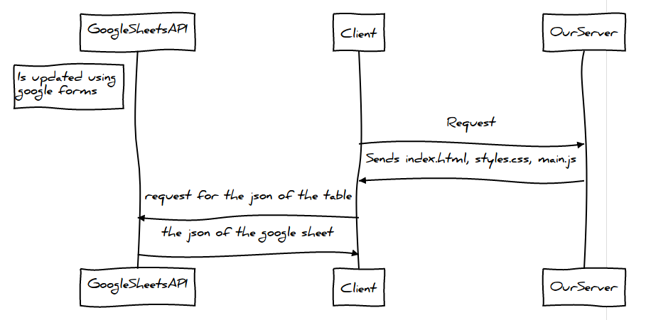

# Canteen menu

## Deployment

1) Install gulp globally (might require `sudo`).

```bash
$ npm install --global gulp-cli pug-cli
```

2) Go inside the directory and install all the dependencies.
```bash
$ npm install
```

3) Generate output files.
```bash
$ npm run build
```

## Architecture

#### Sequence Diagram



Replace JSON with CSV.

Published the page to internet and get the link for CSV.

## Development

The files in `/src` are written in PUG, SASS and TYPESCRIPT which the browser cannot compile directly but these are easier to read and write.

Gulp compiles them into HTML, CSS and JAVASCRIPT respectively which out good old browser is familiar to.

First layer of gulp at `/` compiles to pretty files into `dist/assets`

Second layer of gulp at `dist`, converts the pretty files form `dist/assets` into minified versions at `dist/mini`

> Gulp is just used to build the files, it does not go into the `/dist` files by any means, so security issues in those modules will not be in production.

#### How to preview for development


1) Install gulp globally (might require `sudo`).

```bash
$ npm install --global gulp-cli pug-cli
```

2) Go inside the directory and install all the dependencies.
```bash
$ npm install
```

3) Generate output files and watch changes.
```bash
$ gulp
```

This will serve the output files as well, the link will be show up on the output of this command, leave this running while you are developing.

